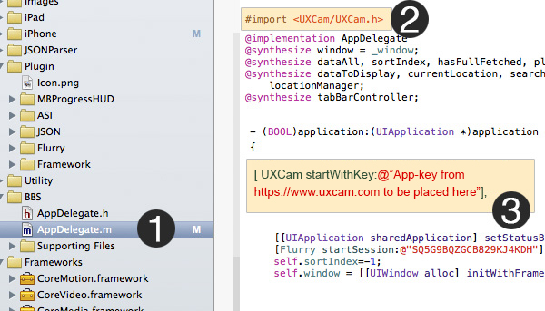
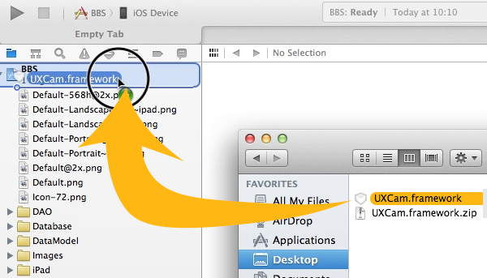
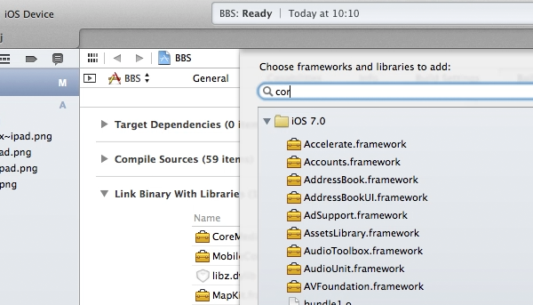

# Introduction

FIXUX LETS YOU RECORD USER’S ACTUAL EXPERIENCE WITH YOUR APP, ATTACH THESE RECORDING TO YOUR FAVORITE TOOLS PROVIDING YOU WITH THE RIGHT INSIGHT YOU NEED TO FIX USER EXPERIENCE AND INCREASE CUSTOMER ENGAGEMENT AND RETENTION.

# Installation

## iOS

### Cocoapods

**Step 1: Cocoapods Integration**

You’ll need to have Cocoapods installed. If you haven’t already, see [this page](https://cocoapods.org/) for installation details. Once you have installed Cocoapods, Create file called ‘Podfile’ containing this:

`platform :ios, '7.0'`

`pod 'UXCam'`

or add

`pod 'UXCam'`

to your existing podfile. Then from your Terminal, type the following commands:

`$ pod install`

Now open the XCode Workspace generated and complete Step 2: 'Start UXCam'.

**Step 2: Start UXCam**

Import the UXCam Agent header at the top of your AppDelegate.m:

`#import &lt;UXCam/UXCam.h&gt;`

Add this call as the first line of your application:didFinishLaunchingWithOptions: method

`[UXCam startWithKey:@"APP KEY"];`

<aside class="notice">
You must replace <code>APP KEY</code> with your personal APP key.
</aside>



### Manual

**Step 1: Manual Integration**

**(a): Download**

[Download](https://dashboard.uxcam.com/app/app/downloadsdk/type/ios) latest SDK.

**(b): Integration**



Unzip the downloaded file and drag the **"UXCam.framework"** from the downloaded UXCam folder into your Xcode project
(dropping it onto your Project in the Project Navigator window). When prompted, select **"Copy items into destination..."**
and **"Create folder references..."**



Then, add these following libraries to your Linker settings. Click on your Project in the Project Navigator window, under Targets select your app, and click the Build Phases tab. <br>
Open the **"Link Binary with Libraries"** list. Click the plus sign (+) and add :-

- AVFoundation<br>
- CoreGraphics<br>
- CoreMedia<br>
- CoreVideo<br>
- MobileCoreServices<br>
- QuartzCore<br>
- SystemConfiguration<br>

**Step 2: Start UXCam**

Import the UXCam Agent header at the top of your AppDelegate.m:

`#import <UXCam/UXCam.h>`

Add this call as the first line of your application:didFinishLaunchingWithOptions: method

`[UXCam startWithKey:@"APP KEY"];`

<aside class="notice">
You must replace <code>APP KEY</code> with your personal APP key.
</aside>


## Android
  
### Android Studio

#### JAR
jar jar 
#### AAR
aar aar
#### MAVEN
maven maven
### Eclipse
 eclipse 
### Others

## Phonegap

# API Reference

## iOS API Reference

### startWithKey

## Android API Reference

<!-- # Authentication

> To authorize, use this code:

```ruby
require 'kittn'

api = Kittn::APIClient.authorize!('meowmeowmeow')
```

```python
import kittn

api = kittn.authorize('meowmeowmeow')
```

```shell
# With shell, you can just pass the correct header with each request
curl "api_endpoint_here"
  -H "Authorization: meowmeowmeow"
```

> Make sure to replace `meowmeowmeow` with your API key.

Kittn uses API keys to allow access to the API. You can register a new Kittn API key at our [developer portal](http://example.com/developers).

Kittn expects for the API key to be included in all API requests to the server in a header that looks like the following:

`Authorization: meowmeowmeow`

<aside class="notice">
You must replace <code>meowmeowmeow</code> with your personal API key.
</aside>

# Kittens

## Get All Kittens

```ruby
require 'kittn'

api = Kittn::APIClient.authorize!('meowmeowmeow')
api.kittens.get
```

```python
import kittn

api = kittn.authorize('meowmeowmeow')
api.kittens.get()
```

```shell
curl "http://example.com/api/kittens"
  -H "Authorization: meowmeowmeow"
```

> The above command returns JSON structured like this:

```json
[
  {
    "id": 1,
    "name": "Fluffums",
    "breed": "calico",
    "fluffiness": 6,
    "cuteness": 7
  },
  {
    "id": 2,
    "name": "Isis",
    "breed": "unknown",
    "fluffiness": 5,
    "cuteness": 10
  }
]
```

This endpoint retrieves all kittens.

### HTTP Request

`GET http://example.com/kittens`

### Query Parameters

Parameter | Default | Description
--------- | ------- | -----------
include_cats | false | If set to true, the result will also include cats.
available | true | If set to false, the result will include kittens that have already been adopted.

<aside class="success">
Remember — a happy kitten is an authenticated kitten!
</aside>

## Get a Specific Kitten

```ruby
require 'kittn'

api = Kittn::APIClient.authorize!('meowmeowmeow')
api.kittens.get(2)
```

```python
import kittn

api = kittn.authorize('meowmeowmeow')
api.kittens.get(2)
```

```shell
curl "http://example.com/api/kittens/3"
  -H "Authorization: meowmeowmeow"
```

> The above command returns JSON structured like this:

```json
{
  "id": 2,
  "name": "Isis",
  "breed": "unknown",
  "fluffiness": 5,
  "cuteness": 10
}
```

This endpoint retrieves a specific kitten.

<aside class="warning">If you're not using an administrator API key, note that some kittens will return 403 Forbidden if they are hidden for admins only.</aside>

### HTTP Request

`GET http://example.com/kittens/<ID>`

### URL Parameters

Parameter | Description
--------- | -----------
ID | The ID of the cat to retrieve -->

